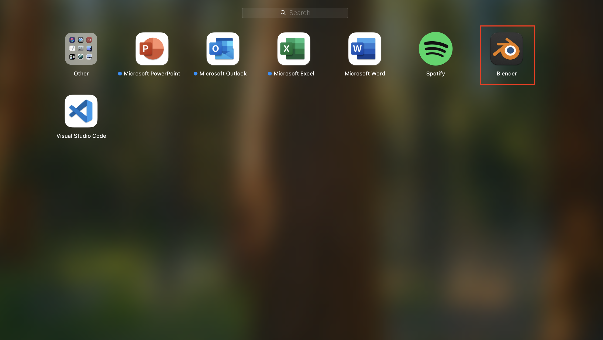
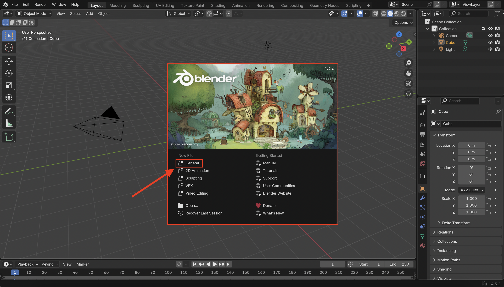
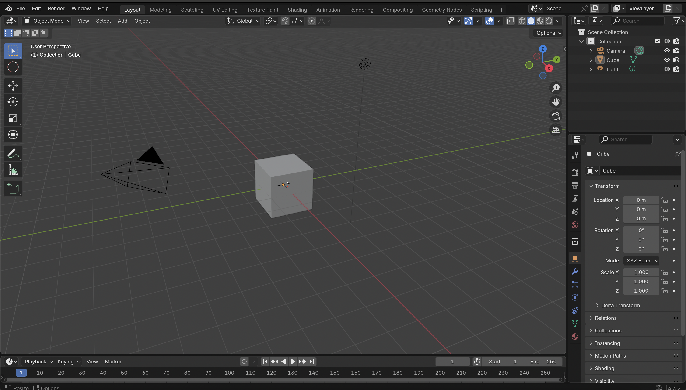

# ✅ Step 1: Open Blender

  
 
1. Launch Blender by double-clicking its icon. 

 

 2. On the splash screen, click the **General** button to start a new project using the default layout.

 

 **A default scene should be loaded** 

