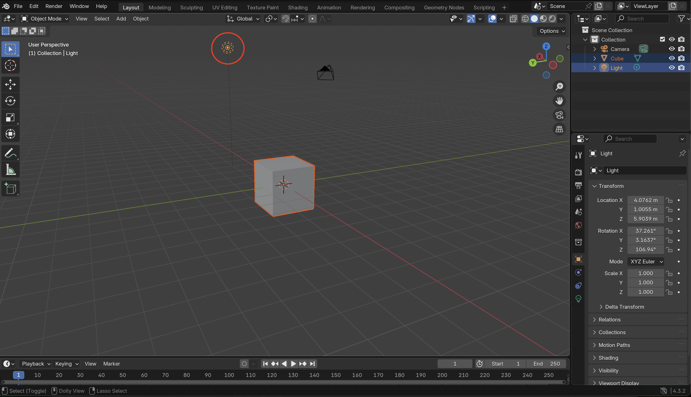
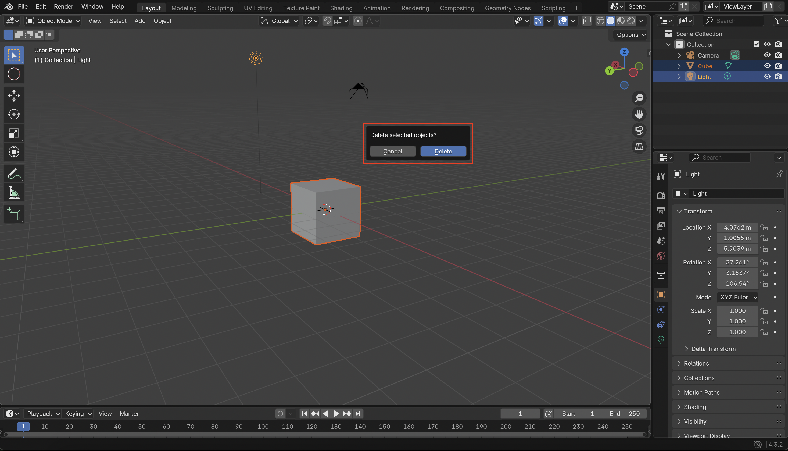
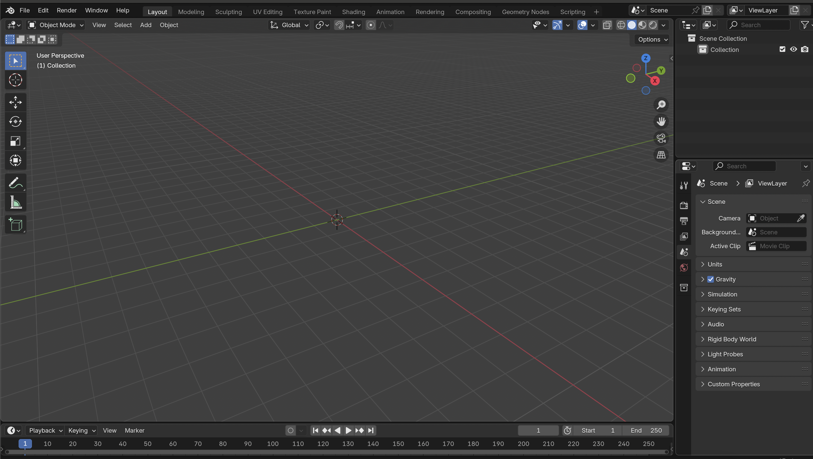

# ✅ Step 2: Delete Default Scene

1. Hold down **Shift** and click on the light in the scene to select both the default cube and the light.

 

2. Press **X** to trigger the delete command.

 

3. Confirm the deletion by pressing **Enter**.

 

4. Your scene should now only have a camera in it, ready to add new objects.

