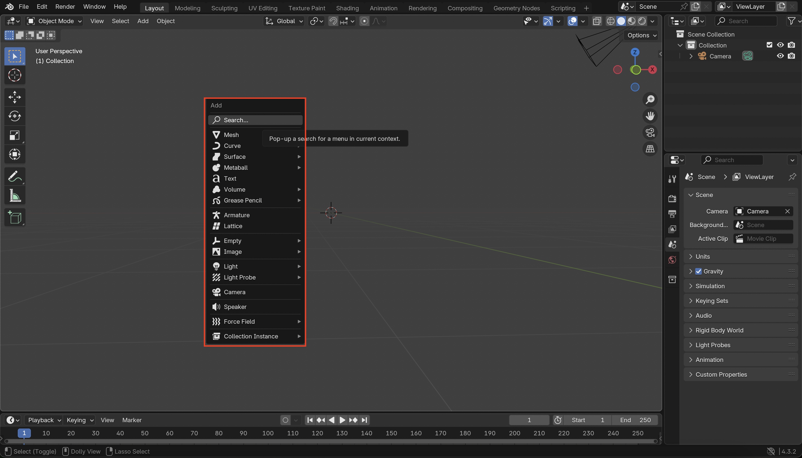
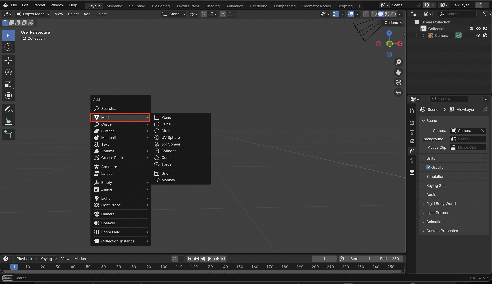
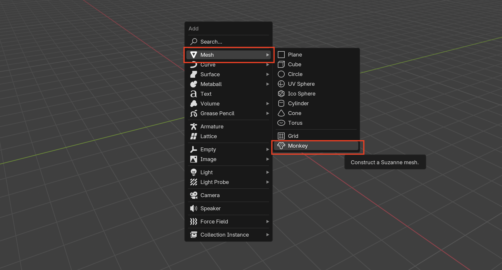

# ✅ Step 3: Add the Monkey Mesh

 

 1. Press **Shift + A** to open the Add menu.

 

 2. Hover over **Mesh** in the menu.

 

 3. Click on **Monkey** to add the monkey mesh to the scene.

 

 **A monkey should appear** 

