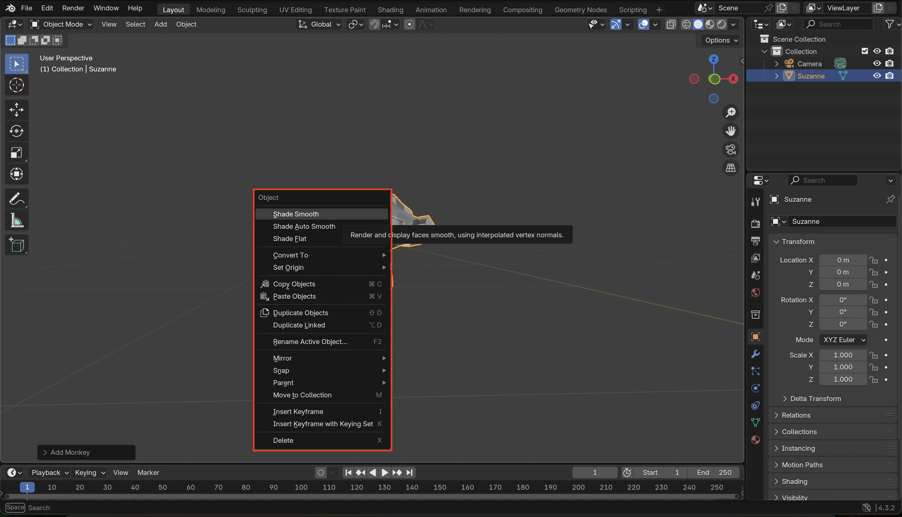
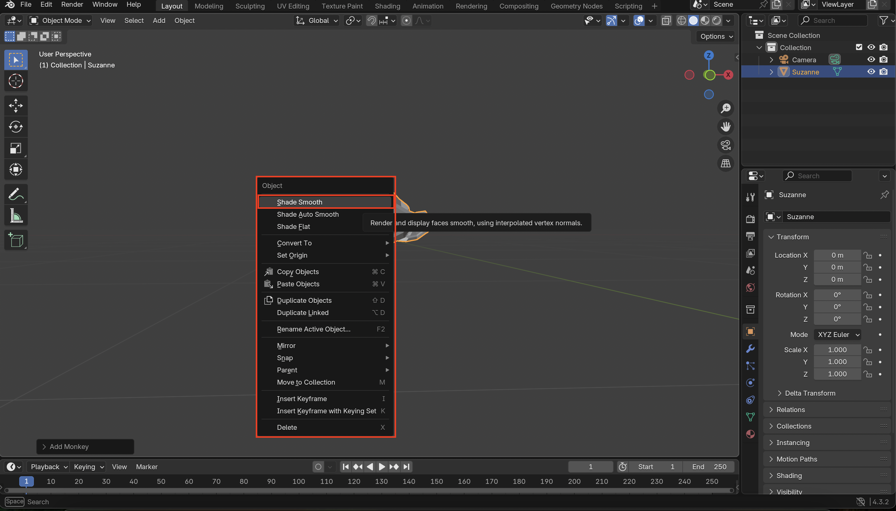
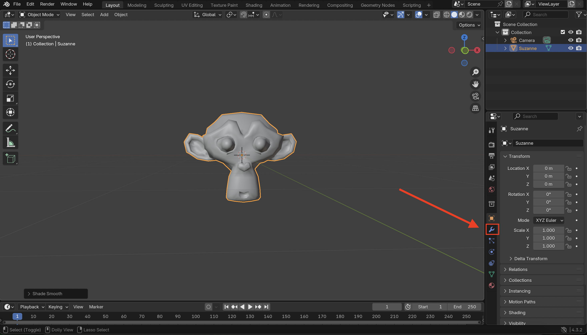
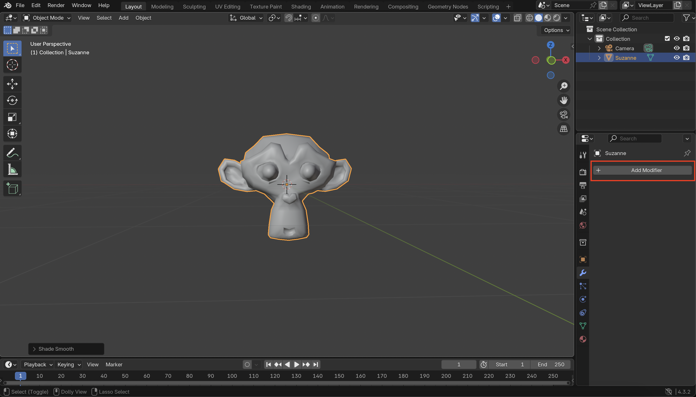
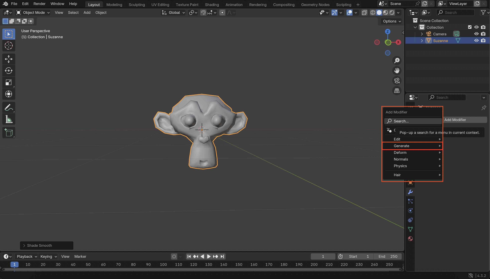
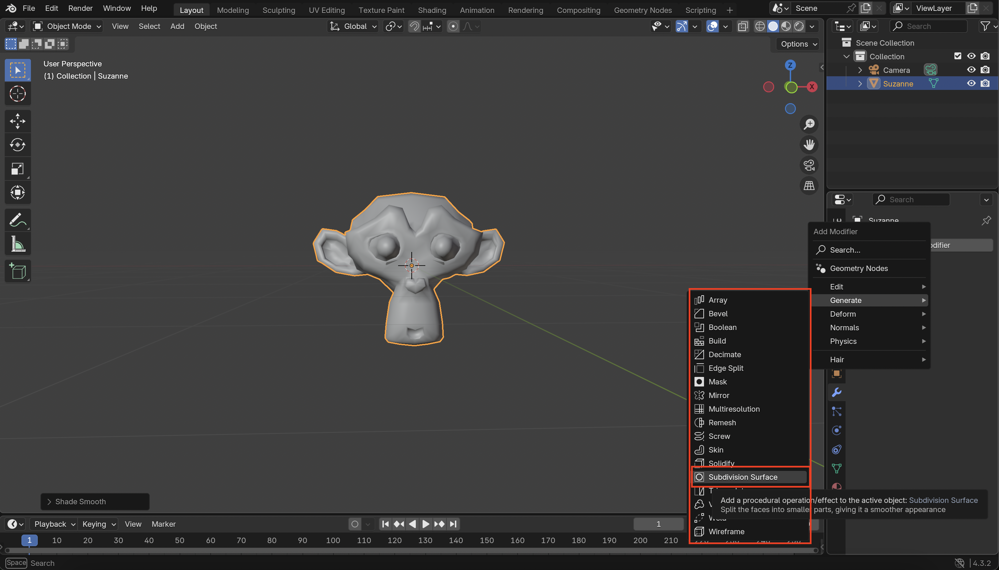
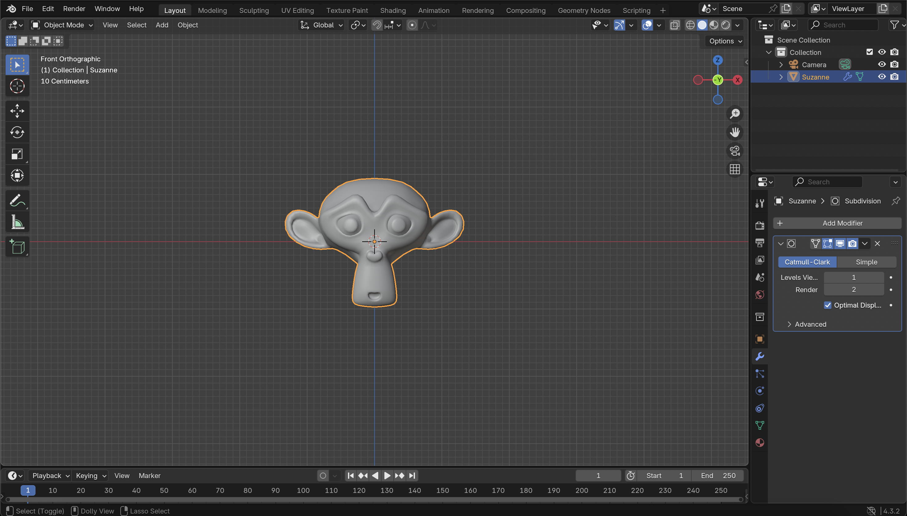

# ✅ Step 5: Smooth the Monkey's Surface

 

1. Right-click on the monkey mesh in the 3D viewport.

 

2. From the context menu, select **Shade Smooth**.

 

3. Next, go to the Modifier Properties tab (click the wrench icon).

 

4. Click **Add Modifier**.

 

5. Hover over the **Generate** button.

 

6. Click on **Subdivision Surface** Modifier.

 

**The Monkey should look a lot smoother now**

