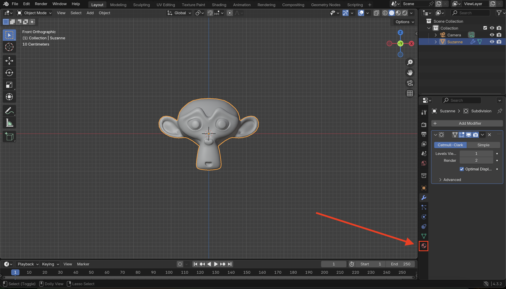
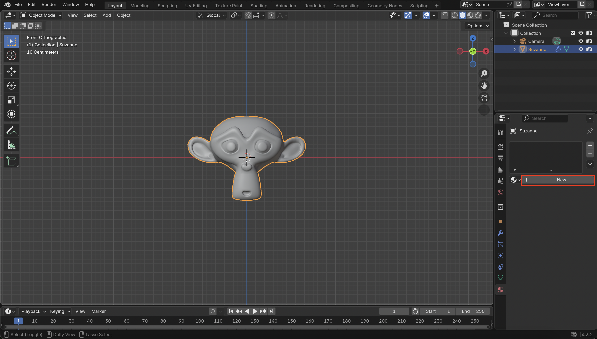
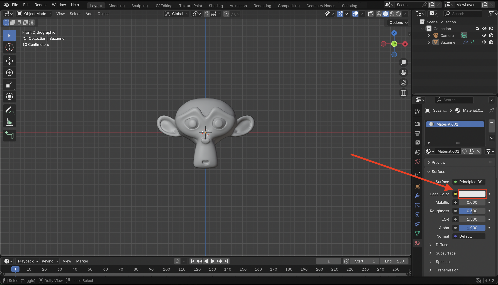
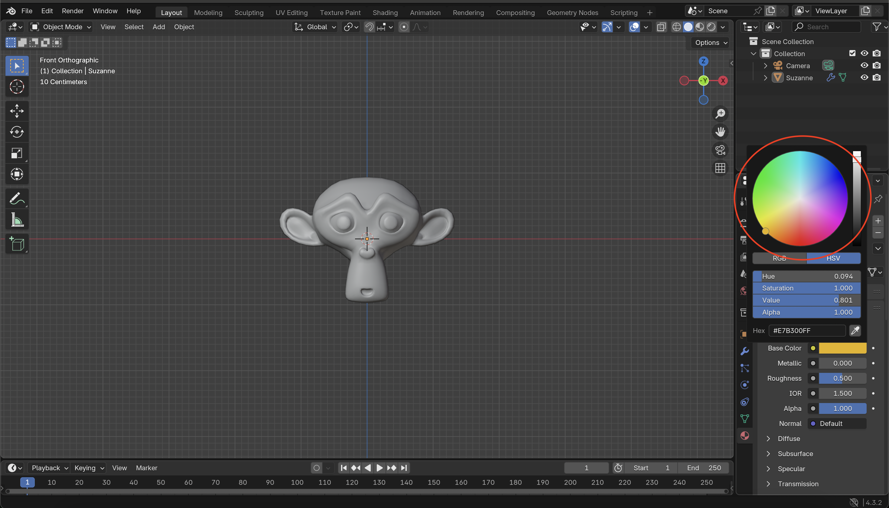

# ✅ Step 5: Add Materials

 

1. Select the monkey mesh by clicking on it.

 

2. Open the **Material Properties** tab (red sphere icon).

 

3. Click the **+ New** button to create a new material.

 

4. Click on the color bar next to **Base Color**

 

5. Select the desired colour you want the monkey to be

 

6. Locate The **Viewport Shading**, and click on the third one from the left (Material Preview)

 

7. Locate the colour adjustment sliders

 

8. Click on the **Metallic** slider, type **1** on your keyboard, then press enter.

 

9. Click on the **Roughness** slider, type **0.1** on your keyboard, then press enter

